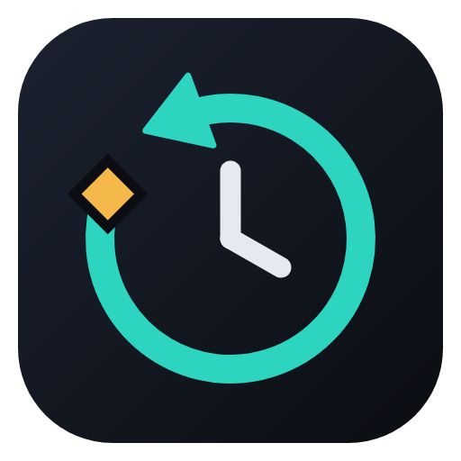
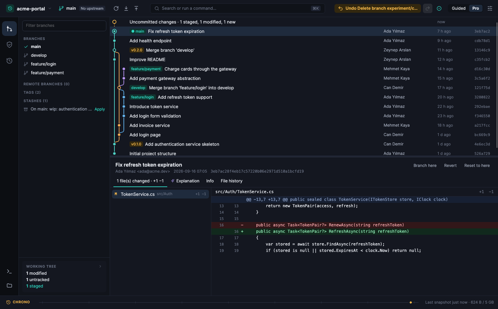
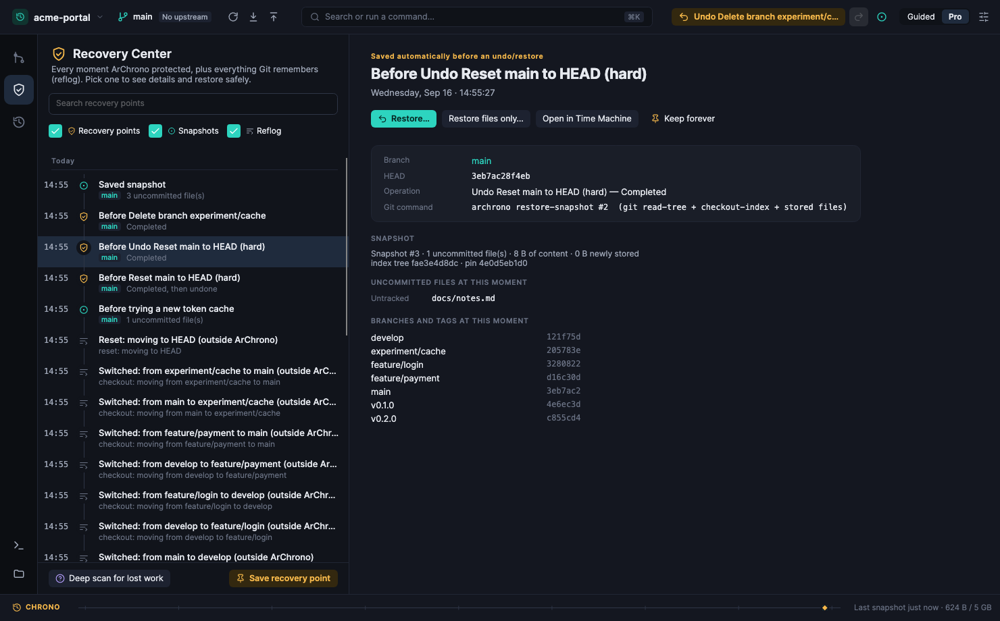
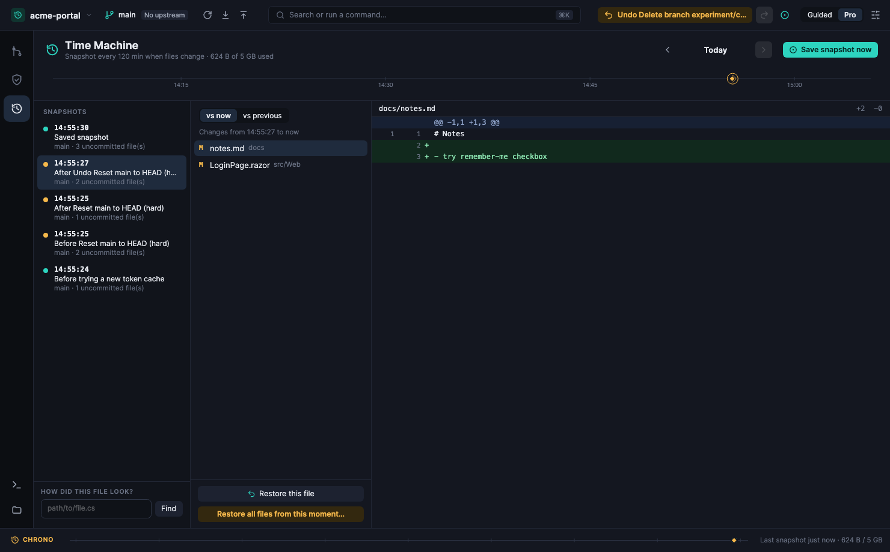
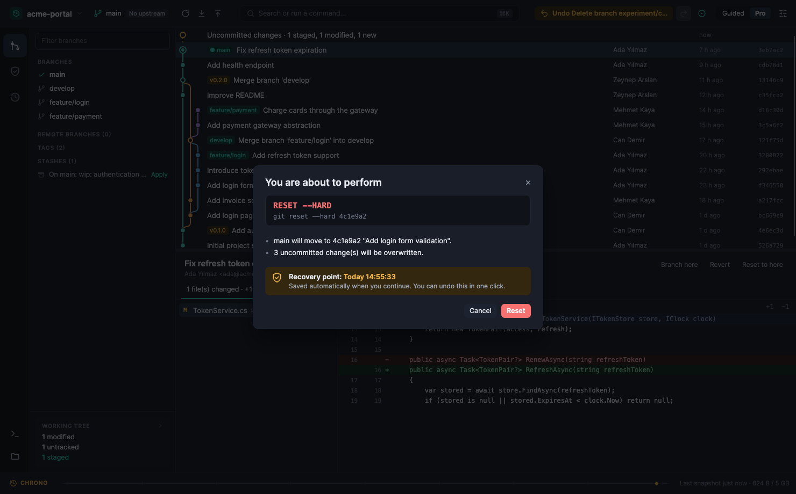
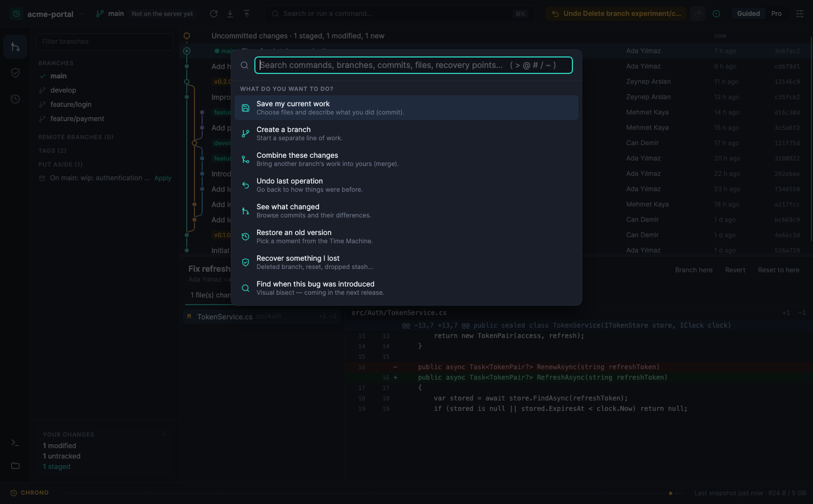

<p align="center"></p>

# ArChrono

**Git without fear.** — kod adı *Git Next*

Windows ve macOS için Git'i değiştirmeyen, ama Git'in korkutucu taraflarını ortadan kaldıran masaüstü Git istemcisi.
Ürünün merkezinde **Recovery** ve **Code Time Machine** var:

> Developer makes mistake → automatic recovery point → operation → **Undo** → original state restored.



## Ne farklı?

| | |
|---|---|
| **Safe Git** | Reset, rebase, branch silme, amend, cherry-pick, revert, stash drop, discard… her durum değiştiren işlem önce otomatik **recovery point** alır. İşlem sonrası tek tık **Undo**; undo'nun kendisi de geri alınabilir (redo). |
| **Recovery Center** | Uygulamanın recovery point'leri + Time Machine snapshot'ları + Git reflog'u (uygulama dışında yapılanlar dahil) + derin tarama ile bulunan kayıp commit/stash'ler **tek zaman çizelgesinde**. Seçici geri dönüş planı: her şey / yalnızca dosyalar / yalnızca branch'ler. |
| **Code Time Machine** | Commit'lerden bağımsız çalışma alanı geçmişi: index + değişen dosyalar + untracked dosyalar. "Bugün 10:15'te bu dosya nasıldı?", snapshot ↔ snapshot/şimdi diff'i, tek dosya veya tüm çalışma alanı geri yükleme. İçerik adresli, sıkıştırılmış, dedup'lı depo; ayarlanabilir saklama ve disk limiti. |
| **Chrono Strip** | Pencerenin altında bugünün zaman ekseni: ◆ recovery point, ○ snapshot, ✕ başarısız işlem. |
| **Türkçe / English · Gece / Gündüz** | Arayüz Türkçe ve İngilizce; varsayılan olarak sistem dilini izler, üst çubuktaki dil menüsünden anında değişir. Gece ve gündüz modu tek tıkla geçer. **Hakkında** penceresi ArSnap ile aynıdır. |
| **Guided / Pro** | Aynı arayüz, iki dil: "Save my current work", "Combine these changes"… veya commit, rebase, reflog ve çalıştırılan gerçek git komutları. |
| **AI (isteğe bağlı, local-first)** | OpenAI, Anthropic, Azure OpenAI, Ollama, OpenAI-compatible. Commit mesajı, commit/branch/conflict açıklaması. Gönderilecek içerik önizlenir, `.env`/anahtar dosyaları hiç gönderilmez, sırlar maskelenir, API anahtarları OS keychain'de. AI sonucu hiçbir zaman otomatik commit edilmez. |

Klasik özellikler de var: commit grafiği, diff (hunk stage), branch/tag/stash, merge ve rebase (çalışma alanına dokunmadan
`git merge-tree` ile **conflict tahmini**), görsel interactive rebase, conflict çözücü (Base/Current/Incoming/Result),
dosya geçmişi, fetch/pull/push (force push daima `--force-with-lease`), komut paleti ve Git Console.

| Recovery Center | Time Machine |
|---|---|
|  |  |
| **Tehlikeli işlem onayı** | **Guided mod komut paleti** |
|  |  |

## Teknoloji

.NET 10 (C#) · Avalonia 12 · SQLite (Microsoft.Data.Sqlite) · sistemdeki `git` (2.38+).
Gerekçe ve alternatiflerin (Tauri, Electron, Flutter, React Native) karşılaştırması: [ADR-0001](docs/adr/0001-desktop-technology.md).

```text
UI (Avalonia MVVM) → Application (RepositorySession, GitActions, TimeMachine, Search, AI)
   → Recovery (SafeOperationRunner, SnapshotEngine, RestorePlanner) + Storage (SQLite) + AI + Platform
   → Git (IGitRunner → git executable)
```

## Çalıştırma

Gereksinimler: .NET 10 SDK, Git 2.38+.

```bash
./scripts/run.sh
```

Belirli bir repository ile açmak için:

```bash
./scripts/run.sh /path/to/repository
```

Testler (Git, storage, snapshot/recovery senaryoları, AI, application — gerçek geçici Git repository'leri üzerinde):

```bash
./scripts/test.sh
```

Ekran görüntülerini yeniden üretmek (headless Skia render, demo repository ile; Türkçe için `--lang tr`):

```bash
./scripts/dotnet.sh run --project tools/ArChrono.Screenshots -- docs/screenshots
```

Paketleme:

```bash
./scripts/package-macos.sh osx-arm64 --dmg
```

Windows kurulum sihirbazı (Setup.exe, NSIS) ve portable zip — macOS'tan çapraz derleme (`brew install makensis`):

```bash
./scripts/package-windows.sh win-x64
./scripts/package-windows.sh win-arm64
```

Windows üzerinde yalnızca exe/zip:

```powershell
.\scripts\publish-windows.ps1 -Runtime win-x64 -Zip
```

Uygulama verisi `~/Library/Application Support/ArChrono` (macOS) veya `%LOCALAPPDATA%\ArChrono` (Windows) altında tutulur;
test/deneme için `ARCHRONO_DATA_DIR` ortam değişkeniyle değiştirilebilir. Repository içine yalnızca gc koruması için
`refs/archrono/pins/*` ref'leri yazılır (Ayarlar'dan kapatılabilir, komut paletinden temizlenebilir).

## Dokümantasyon

| | |
|---|---|
| Rakip analizi | [docs/design/competitive-analysis.md](docs/design/competitive-analysis.md) |
| UI navigasyonu ve tasarım dili | [docs/design/ui-navigation.md](docs/design/ui-navigation.md) |
| Mimari genel bakış ve klasör yapısı | [docs/architecture/overview.md](docs/architecture/overview.md) |
| Git soyutlama katmanı | [docs/architecture/git-abstraction.md](docs/architecture/git-abstraction.md) |
| Snapshot engine ve Time Machine | [docs/architecture/snapshot-engine.md](docs/architecture/snapshot-engine.md) |
| Recovery modeli | [docs/architecture/recovery-model.md](docs/architecture/recovery-model.md) |
| SQLite şeması | [docs/architecture/sqlite-schema.md](docs/architecture/sqlite-schema.md) |
| MVP milestone'ları, Phase 2/3, bilinen sınırlar | [docs/roadmap/mvp-milestones.md](docs/roadmap/mvp-milestones.md) |
| ADR'ler | [0001 Teknoloji](docs/adr/0001-desktop-technology.md) · [0002 Git CLI](docs/adr/0002-git-integration.md) · [0003 Snapshot deposu](docs/adr/0003-snapshot-storage.md) · [0004 Recovery](docs/adr/0004-recovery-and-safe-operations.md) · [0005 AI](docs/adr/0005-ai-provider-abstraction.md) · [0006 SQLite](docs/adr/0006-metadata-storage-sqlite.md) · [0007 Sırlar](docs/adr/0007-credentials-and-secrets.md) · [0008 Terminal/agent](docs/adr/0008-terminal-and-agent-workspaces.md) |
